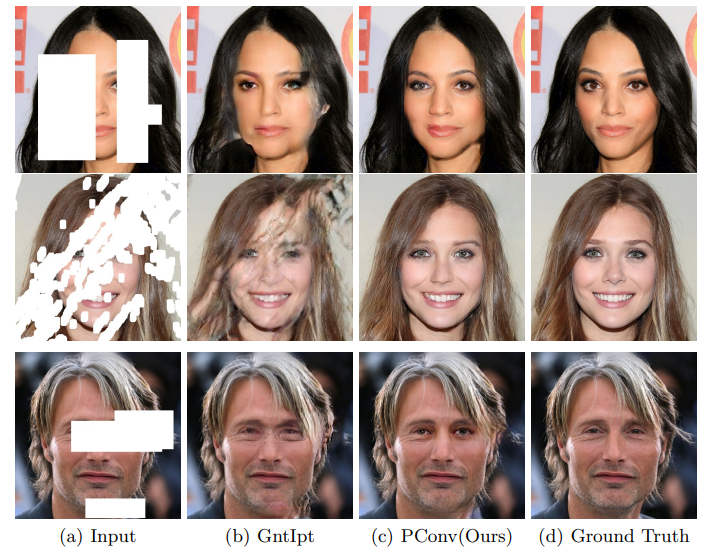

# Image Inpainting for Irregular Holes Using Partial Convolutions
Created an implementation of [this](https://arxiv.org/abs/1804.07723) paper.
Partial convolution is masked and renormalized to be conditioned on only valid pixels. Further included a mechanism to automatically generate an updated mask for the next layer as part of the forward pass.   

